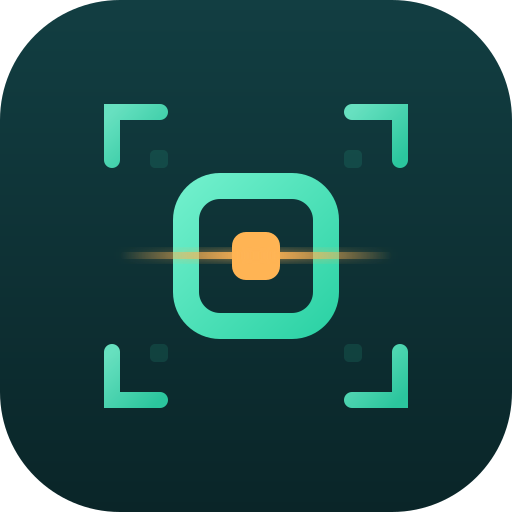
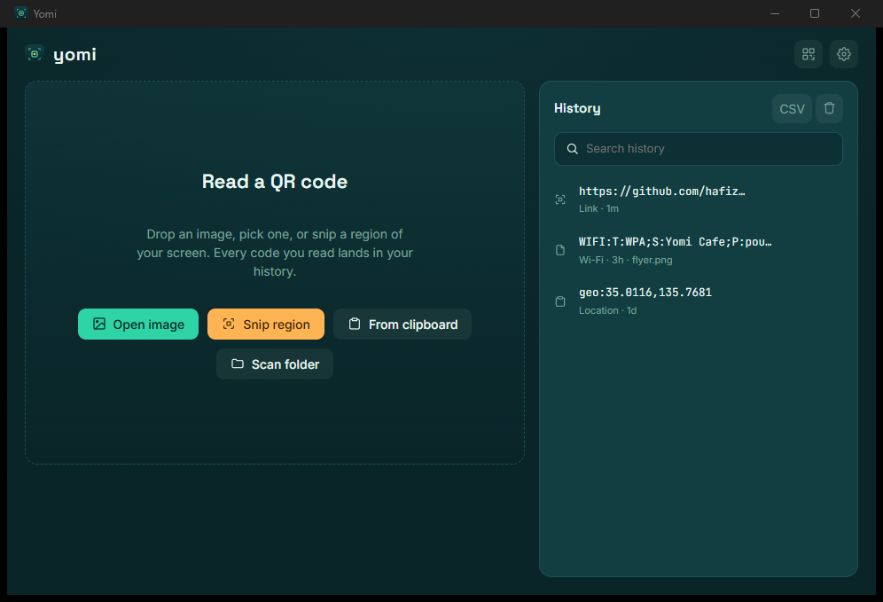

<div align="center">
  
  <h1>Yomi</h1>
  <p>A desktop QR reader for laptops. Point it at an image or snip a region of your screen, and it pulls the link out and hands it to you, ready to copy or open. Every scan lands in a searchable history.</p>
  <p>
    <a href="https://github.com/hafizmnazman"></a>
  </p>
  
</div>

> The name is from Japanese 読み (*yomi*, "reading"), as in 読み取り (*yomitori*), the word for QR scanning.

## What it does

Three ways in, one result surface:

1. **Open an image.** Pick a file or drag one onto the window.
2. **Snip a region.** A button or a global hotkey freezes the screen; drag a box over the code and it decodes that crop.
3. **From the clipboard.** Already grabbed a screenshot with the system snip? Read it straight off the clipboard.

If a code is found, the content shows with **Copy** and, where it makes sense, **Open**. URLs, Wi-Fi configs, contacts, geo, SMS, email and phone are recognized and parsed. If nothing is found, it says so plainly.

## Features

- File scan, drag-and-drop, and multi-file / whole-folder **batch** scanning
- **Snip** with a freeze-then-select overlay, correct across HiDPI and multi-monitor setups
- **System tray** + a global **hotkey** (default `Ctrl+Shift+Q`) to snip from anywhere, even with the window hidden
- Searchable **history** with re-copy, re-open, delete, clear, and **CSV export**
- Payload parsing for URL, Wi-Fi, geo, SMS, email, phone and vCard, plus multi-QR images
- A built-in **QR generator** (the reverse direction): turn text or a URL into a PNG
- Settings: rebindable hotkey, optionally record scans that find nothing
- Honors `prefers-reduced-motion`, visible keyboard focus, responsive layout

## Stack

[Tauri 2](https://tauri.app) with a Rust backend and a React + TypeScript frontend on Vite.

- **Rust** owns the heavy lifting: QR decode ([`rqrr`](https://crates.io/crates/rqrr)), screen capture ([`xcap`](https://crates.io/crates/xcap)), image handling ([`image`](https://crates.io/crates/image)), QR generation ([`qrcode`](https://crates.io/crates/qrcode)), DPI math, and content classification.
- **React** owns the surface: the scan view, result card, history rail, and the selection overlay.
- **Plugins** cover file dialogs, opening URLs, the clipboard, persistence, and the global shortcut.

## Getting started

Prerequisites: [Node.js](https://nodejs.org), the [Rust toolchain](https://rustup.rs), and the [Tauri prerequisites](https://tauri.app/start/prerequisites/) for your OS (on Windows: the WebView2 runtime and MSVC build tools).

```bash
npm install
npm run tauri dev      # run in development
npm run tauri build    # produce release bundles (MSI/NSIS, .dmg, AppImage/.deb)
```

Other scripts:

```bash
npm run build          # type-check + bundle the frontend
npm run icon           # regenerate every icon size from yomi-icon.svg
cargo test --manifest-path src-tauri/Cargo.toml   # run the Rust unit tests
```

## Project layout

```
src/            React frontend (App, overlay, components, lib)
src-tauri/      Rust backend (decode, capture, tray, commands) + config
implementation.md   the full build guide and design notes
```

See [implementation.md](implementation.md) for the design, the phased roadmap, and the known gotchas (DPI scaling, multi-monitor coordinates, platform notes).

## License

[MIT](LICENSE) © Hafiz Azman

Built by [@hafizmnazman](https://github.com/hafizmnazman). Follow along on GitHub for more.
