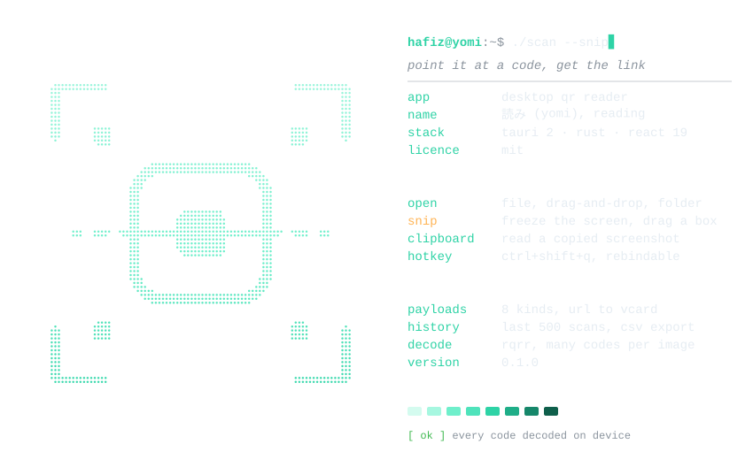
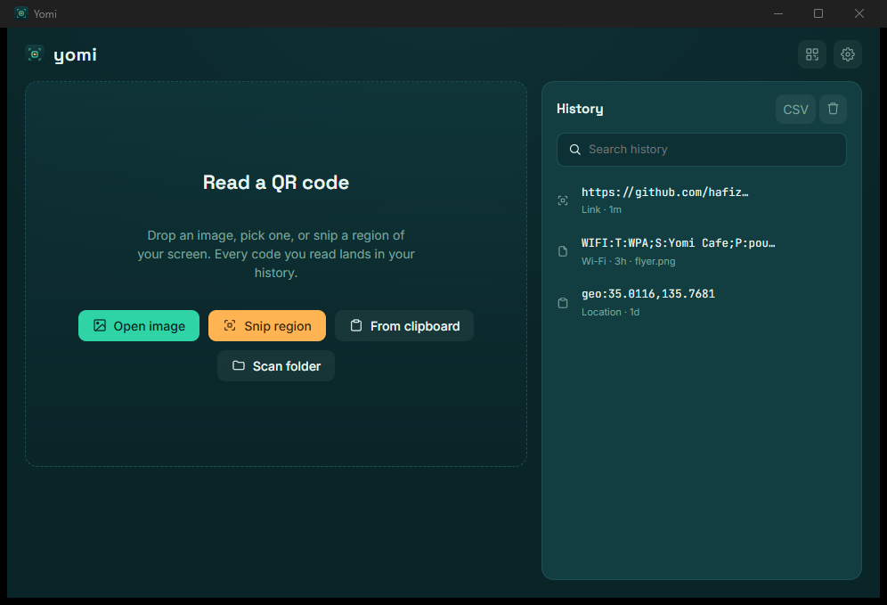
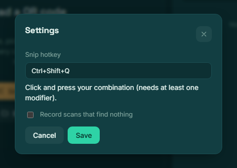
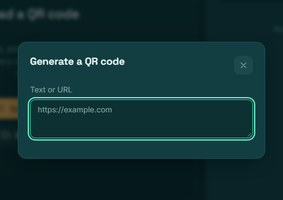

<div align="center">
  <picture>
    <source media="(prefers-color-scheme: dark)" srcset=".github/readme/banner-dark.svg">
    <source media="(prefers-color-scheme: light)" srcset=".github/readme/banner-light.svg">
    
  </picture>
</div>

<div align="center">
  <picture>
    <source media="(prefers-color-scheme: dark)" srcset=".github/readme/card-dark.svg">
    <source media="(prefers-color-scheme: light)" srcset=".github/readme/card-light.svg">
    
  </picture>
</div>

<p align="center">
  <a href="#hafizyomi-cat-stack"></a>
  <a href="#hafizyomi-ls-features"></a>
  <a href="LICENSE"></a>
</p>

```text
hafiz@yomi:~$ cat ./about
a desktop qr reader for laptops. point it at an image or snip a region of
your screen, and it pulls the link out, ready to copy or open. every scan
lands in a searchable history.

hafiz@yomi:~$ grep -o '"[a-z]*"' src/lib/types.ts | head -8 | xargs
url email phone sms wifi geo vcard text
```

> The name is from Japanese 読み (*yomi*, "reading"), as in 読み取り (*yomitori*), the word for QR scanning.

### <samp>hafiz@yomi:~$ ./yomi</samp>

<p align="center">
  
</p>

Three ways in, one result surface:

1. **Open an image.** Pick a file or drag one onto the window.
2. **Snip a region.** A button or a global hotkey freezes the screen; drag a box over the code and it decodes that crop.
3. **From the clipboard.** Already grabbed a screenshot with the system snip? Read it straight off the clipboard.

If a code is found, the content shows with **Copy** and, where it makes sense,
**Open**. URLs, Wi-Fi configs, contacts, geo, SMS, email and phone are
recognized and parsed. If nothing is found, it says so plainly.

### <samp>hafiz@yomi:~$ ls ./features</samp>

- File scan, drag-and-drop, and multi-file or whole-folder **batch** scanning
- **Snip** with a freeze-then-select overlay, correct across HiDPI and multi-monitor setups
- **System tray** and a global **hotkey** (default `Ctrl+Shift+Q`) to snip from anywhere, even with the window hidden
- Searchable **history** with re-copy, re-open, delete, clear, and **CSV export**
- Payload parsing for URL, Wi-Fi, geo, SMS, email, phone and vCard, plus multi-QR images
- A built-in **QR generator** (the reverse direction): turn text or a URL into a PNG
- Settings: rebindable hotkey, optionally record scans that find nothing
- Honors `prefers-reduced-motion`, visible keyboard focus, responsive layout

<table>
  <tr>
    <td width="50%"><samp>settings, rebind the snip hotkey</samp></td>
    <td width="50%"><samp>the qr generator, text in, png out</samp></td>
  </tr>
  <tr>
    <td></td>
    <td></td>
  </tr>
</table>

### <samp>hafiz@yomi:~$ cat ./stack</samp>

[Tauri 2](https://tauri.app) with a Rust backend and a React + TypeScript frontend on Vite.

| layer | owns |
|:--|:--|
| **Rust** | The heavy lifting: QR decode ([`rqrr`](https://crates.io/crates/rqrr)), screen capture ([`xcap`](https://crates.io/crates/xcap)), image handling ([`image`](https://crates.io/crates/image)), QR generation ([`qrcode`](https://crates.io/crates/qrcode)), DPI math, and content classification |
| **React** | The surface: the scan view, result card, history rail, and the selection overlay |
| **Plugins** | File dialogs, opening URLs, the clipboard, persistence, and the global shortcut |

### <samp>hafiz@yomi:~$ npm run tauri dev</samp>

Prerequisites: [Node.js](https://nodejs.org), the [Rust toolchain](https://rustup.rs),
and the [Tauri prerequisites](https://tauri.app/start/prerequisites/) for your OS
(on Windows: the WebView2 runtime and MSVC build tools).

```bash
npm install
npm run tauri dev      # run in development
npm run tauri build    # produce release bundles (MSI/NSIS, .dmg, AppImage/.deb)
```

Other scripts:

```bash
npm run build          # type-check + bundle the frontend
npm run icon           # regenerate every icon size from yomi-icon.svg
cargo test --manifest-path src-tauri/Cargo.toml   # run the Rust unit tests
```

### <samp>hafiz@yomi:~$ tree -L 1</samp>

```text
src/                React frontend (App, overlay, components, lib)
src-tauri/          Rust backend (decode, capture, tray, commands) + config
implementation.md   the full build guide and design notes
```

See [implementation.md](implementation.md) for the design, the phased roadmap,
and the known gotchas (DPI scaling, multi-monitor coordinates, platform notes).

### <samp>hafiz@yomi:~$ cat LICENSE</samp>

[MIT](LICENSE) © Hafiz Azman

Built by [@hafizmnazman](https://github.com/hafizmnazman). Follow along on GitHub for more.

<sub>The banner and card are generated by <code>.github/readme/build.py</code> (standard library Python). Change a value at the top and run it again.</sub>
